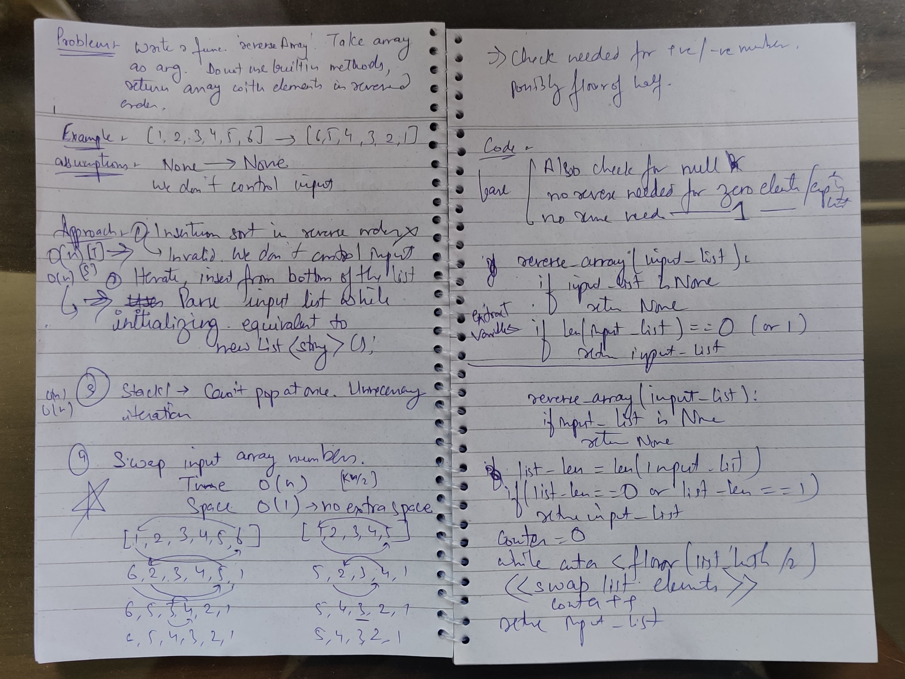
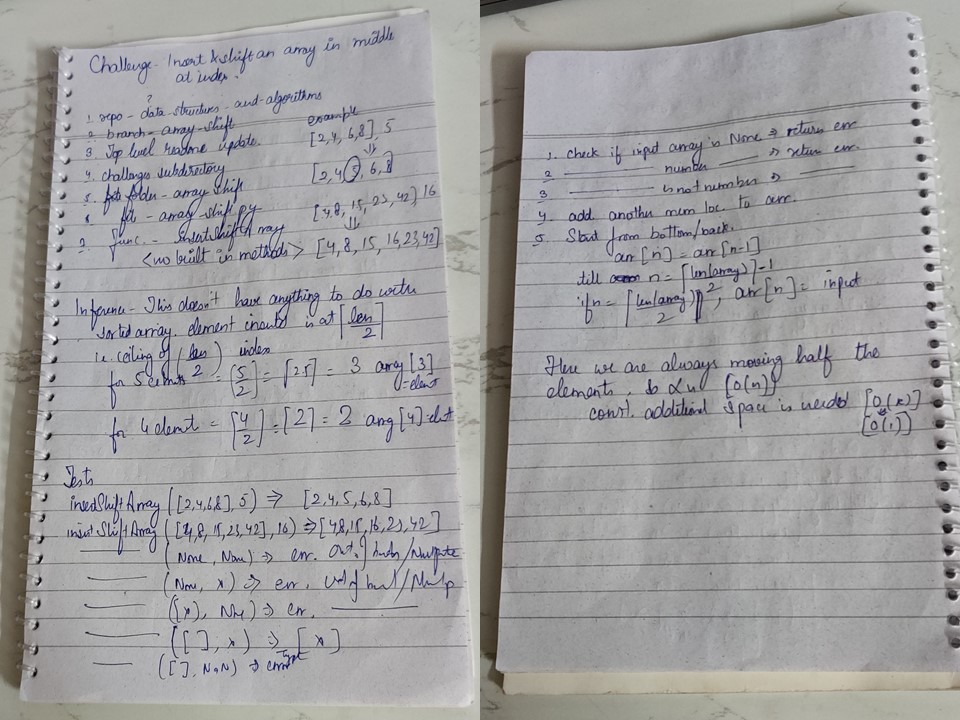

# Table of contents

## Challenges

### Reverse an Array

The challenge is for Class 01.

#### Challenge Description

Write a function called reverseArray which takes an array as an argument. Without utilizing any of the built-in methods
available to your language, return an array with elements in reversed order.

#### Approach & Efficiency

The array is being passed as an argument to the function.
The array is already been passed as an argument. Hence, insertion sort while inserting data from the user is not a
viable approach.
Ideal approach would be to read the input array and manipulate data in-place. The details are in the solution

#### Solution
[Code](/data_structures_and_algorithms/challenges/array_reverse/array_reverse.py)

### Array shift

The challenge is for Class 02.

#### Challenge Description

Write a function called insertShiftArray which takes in an array and the value to be added. Without utilizing any of the
built-in methods available to your language, return an array with the new value added at the middle index.

#### Approach & Efficiency

The approach is to add an element at the end of the array, shift the array till the mid and then replace the middle
element with the input value. Since the array has to be traversed till half the length, the time complexity increases
linearly with the elements in the array i.e. O(n). The solution uses a constant space, hence the space complexity is
O(1).

#### Solution
[Code](/data_structures_and_algorithms/challenges/array_shift/array_shift.py)

